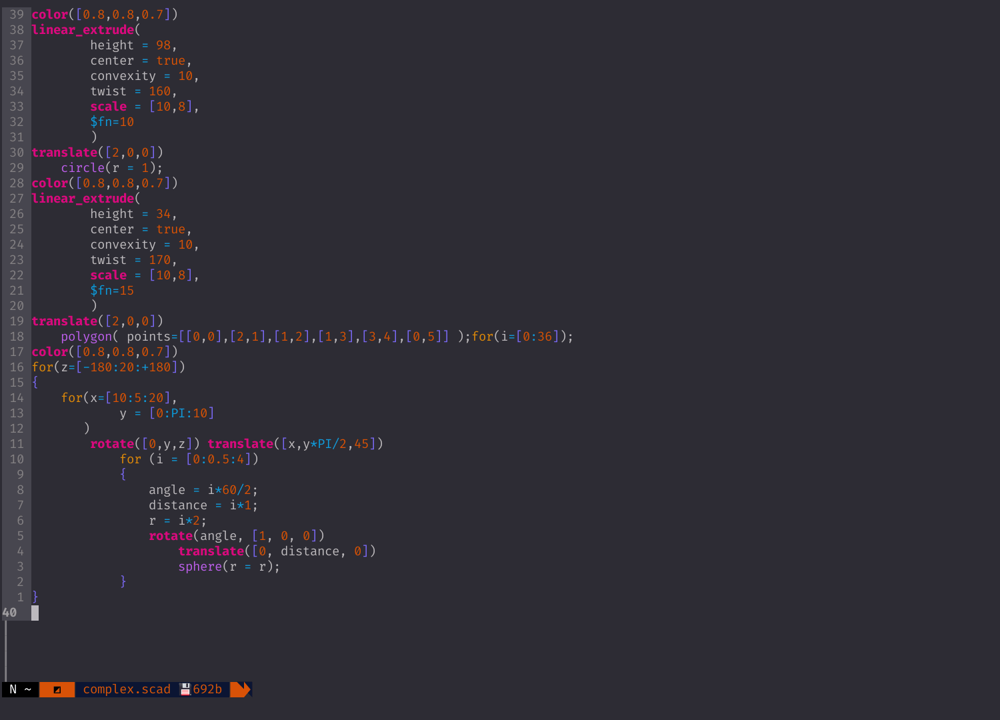

# openscad.nvim

Syntax highlighting, cheatsheet, offline manual and fuzzy help plugin for the openscad language

OpenSCAD help system and syntax highlighting in Neovim.
This plugin was first created as a companion to [the original openscad syntax highlighting](https://github.com/sirtaj/vim-openscad).
But it now contains a modified and updated version. In addition a `openscad-help` filetype and syntax is implemented.

In the future maybe lsp, error checking, hints and completion will exist here. 

Note that some features of this plugin is `*NIX` only

## Requirements

Nvim >= 0.5 (nightly)

## Dependencies

Run `:checkhealth` to see if you fulfill the dependencies and requirements.

- [zathura](https://github.com/pwmt/zathura)
- [skim](https://github.com/lotabout/skim.vim) or [fzf](https://github.com/junegunn/fzf.vim)
- [htop](https://htop.dev)
- [LuaSnip](https://github.com/L3MON4D3/LuaSnip)(optional)

## Install

* To install using packer.nvim
    1. Add this to your plugins.lua:
    ```lua
    use {
        'salkin-mada/openscad.nvim',
		requires = 'L3MON4D3/LuaSnip'
            config = function ()
                require('openscad')

				-- Import snippets
				require"luasnip".snippets.openscad = require"openscad".get_snippets()

                end
    }
    ```
    2. run `:PackerInstall` or `:PackerSync` and compile lazy-loaders

* To install using vim-plug
    1. Add this to your init.vim / .vimrc:
    `Plug 'salkin-mada/openscad.nvim'`
    2. do a `:PlugInstall`
    3. add `lua require('openscad')` to your `init.vim`
    ```vimscript
    lua require('openscad.nvim')
    ```

## Available mappings

`<Enter>`/`<C-m>` in normal mode
Toggle cheatsheet window


`<A-h>` in normal mode
Fuzzy find help resource


`<A-m>` in normal mode
Open offline openscad manual in pdf via `zathura`


`<A-o>` in normal mode
Open file in OpenSCAD


`<A-c>` in normal mode
toggle `htop` filtered for openscad processes


## Options


These are the defaults:
```lua
vim.g.openscad_fuzzy_finder = 'skim'
vim.g.openscad_cheatsheet_window_blend = 15 --%
-- should the openscad project automatically be opened on startup
vim.g.openscad_auto_open = false
```

## Mappings

`openscad.nvim` mappings is by default *not* enabled.

```lua
vim.g.openscad_default_mappings = true
```

The default mappings are:
```lua
vim.g.openscad_cheatsheet_toggle_key = '<Enter>'
vim.g.openscad_help_trig_key = '<A-h>'
vim.g.openscad_help_manual_trig_key = '<A-m>'
vim.g.openscad_exec_openscad_trig_key = '<A-o>'
vim.g.openscad_top_toggle = '<A-c>'
```

* *Options* and *Mappings* may be defined in either Lua or Vimscript.
